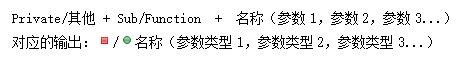
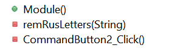
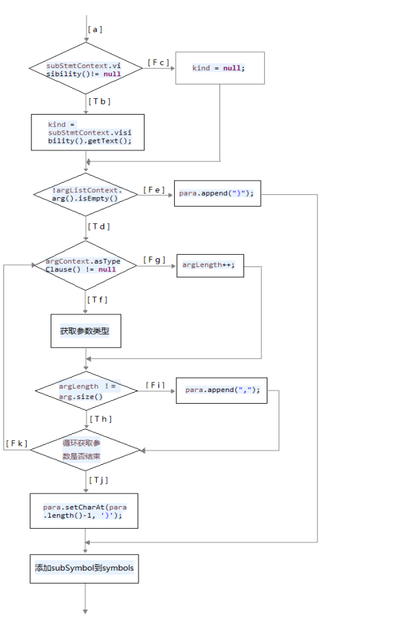
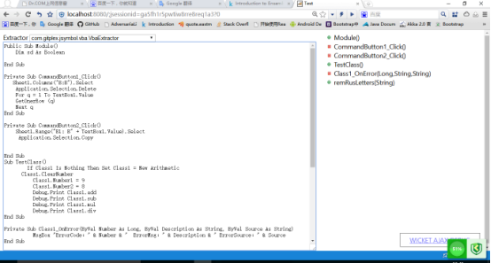
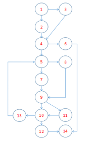

### 1.开发环境
 
	  JDK版本：jdk1.8

	 集成环境：eclipse neon.3 Release(4.6.3)

### 2.大纲

   **2.1 VBA语言介绍**
   
    2.1.1 VBA简介 
	 VBA（Visual Basic for Applications）是Visual Basic的一种宏语言，它与传统的宏语言不同，传统的宏语言不具有高级语言的特征，没有面向对象的程序设计概念和方法。而VBA 提供了面向对象的程序设计方法，提供了相当完整的程序设计语言，并且提供了可视化的编程环境。VBA是微软开发出来在其桌面应用程序中执行通用的自动化(OLE)任务的编程语言。主要能够用来扩展Windows的应用程序功能，特别是Microsoft Office软件（Word、Excel、Access、Powerpoint）。也可说它是一种应用程序 视觉化的Basic 脚本。 VBA的语法与独立运行的Visual Basic编程语言互相兼容，它使得在Microsoft Office系列软件中快速开发应用程序更加容易，且可以完成特殊的、复杂的操作。实际上VBA是寄生于VB应用程序的版本，VBA是VB的一个子集。
    2.1.2 VBA与VB的区别
	  (1) VB是设计用于创建标准的应用程序,而VBA是使已有的应用程序(EXCEL等)自动化。
	  (2) VB具有自己的开发环境，而VBA必须寄生于已有的应用程序。
	  (3) 要运行VB开发的应用程序，用户不必安装VB，因为VB开发出的应用程序是可执行文件(*.EXE)，而VBA开发的程序必须依赖于它的“父”应用程序   
    2.1.3 VBA的应用
	  (1) 规范用户的操作，控制用户的操作行为；
	  (2) 操作界面人性化，方便用户的操作；
	  (3) 多个步骤的手工操作通过执行VBA代码可以迅速的实现；
	  (4) 实现一些VB无法实现的功能。
	  (5) 用VBA制做EXCEL登录系统。
	  (6) 利用VBA可以Excel内轻松开发出功能强大的自动化程序。

 **2.2 期望实现的大纲结构**
 
    用java编写一个VbaExtractor类，完成对vba程序中Sub过程名和Function函数名的提取，
    并显示出其中的参数类型。Private属性的过程名和函数名前添加红色方框，Public属性加绿色圆点。
    VBA语言中数据的类型共以下12种：
		字符串型 String  
		字节型 Byte  
		布尔型 Boolean 
		整数型 Integer
		长整数型 Long 
		单精度型 Single 
		双精度型 Double 
		日期型 Date 
		货币型 Currency
		小数点型 Decimal 
		变体型 Variant
    另外过程的参数可以缺省，显示为空。期望实现的大纲结构如下：
　                         　 
		
		实例：

			Public Function Module()
				Dim sd As Boolean
			End Function

			Private Sub remRusLetters(valForClean As String) 
			   Sheet1.Columns("B:B").Select  
				Application.Selection.Delete  
				For q = 1 To TextBox1.Value  
				GetOnerRow (q)  
				Next q  
			End Sub  
 
			Private Function CommandButton2_Click()  
				Sheet1.Range("B1: B" + TextBox1.Value).Select  
				 Application.Selection.Copy
			End Function  
		
	 

 _Outline:_   

### 3.大纲实例在代码中的实现方式及代码结构阐述

**3.1 代码实现方式**
 
    大纲实例如上所示：代码结构主要就是三个函数，每个函数有自己所调用的参数以及功能，
	我们在解析的过程中主要过程如下：
	 （1）第一步：解析出函数类型，即public或者private，然后确定该函数是Function函数
	        还是Sub过程函数分别调用自定义的processFunctionStmt()和 processSubStmt()
			方法来进一步解析。
	 （2）第二步：解析出函数名是什么
	 （3）第三步：解析出函数所调用的参数，最后解析出函数调用参数的类型
	具体函数内部实现的内容，我们暂且不解析。

**3.2 代码结构**

 

### 4.网页代码解析实例

### 5.测试类说明

　　**5.1性能测试**

         单个文件（2000行+）词法分析所用的时间：22ms
	 单个文件（2000行+）语法+词法分析所用的时间：1466ms
	 多个文件（100以上）进行代码解析时平均每个文件所用时间：120ms

　　**5.2白盒测试**

          分别使用语句覆盖、判定覆盖（也称为分支覆盖）、条件覆盖、判定-条件覆盖、条件组合测试、路径测试设计测试用例,并执行每个测试用例
         
         (1)语句覆盖:
         测试用例：
         Private Sub Classs1_OnError(ByVal Number As Long, ByVal Description As String, ByVal Source As String)
			  MsgBox "ErrorCode：" & Number & "　ErrorMsg：" & Description & " ErrorSource：" & Source
         End Sub

         执行的路径：a b d f h k f h k f h j
         
         (2)判定覆盖:
   
            当“subStmtContext.visibility()!= null”为真时记为R1，为假时记为-R1;                 
            当“!argListContext.arg().isEmpty()”为真时记为R2，为假时记为-R2。
            当“argContext.asTypeClause() != null”为真时记为R3，为假时记为-R3;
            当“argLength != arg.size()”为真时记为R4，为假时记为-R4;
            当“循环获取参数是否结束”为真时记为R5，为假时记为-R5;
	

        测试用例1：
	Public Sub Module(ByVal Number As Long)
		Dim sd As Boolean
	End Sub
	测试用例2：
	Sub CommandButton1_Click()  
	   Sheet1.Columns("B:B").Select  
		Application.Selection.Delete  
		For q = 1 To TextBox1.Value  
		GetOnerRow (q)  
		Next q  
	End Sub 
	测试用例3：
	Public Sub CommandButton1_Click(ByVal Description)  
	   Sheet1.Columns("B:B").Select  
		Application.Selection.Delete  
		For q = 1 To TextBox1.Value  
		GetOnerRow (q)  
		Next q  
	End Sub
	测试用例4：
	Public Sub CommandButton1_Click(ByVal Description as Long,ByVal Source As String)  
	   Sheet1.Columns("B:B").Select  
		Application.Selection.Delete  
		For q = 1 To TextBox1.Value  
		GetOnerRow (q)  
		Next q  
	End Sub 
   
        (3)条件覆盖、条件组合覆盖:由于每个判定只有一个条件，故同判定覆盖。
        (4)路径覆盖：

> 路径流图: 

                路径1： 1->3->4->5->7->9->10->12->14
		路径2： 1->3->4->5->7->9->10->13->5->7->9->10->12->14
		路径3： 1->3->4->5->7->9->10->13->5->8->9->10->12->14
		路径4： 1->3->4->5->8->9->10->13->5->7->9->10->12->14
		路径5： 1->3->4->5->8->9->10->13->5->8->9->11->10->12->14
		路径6： 1->3->4->5->8->9->11->10->12->14
		路径7： 1->3->4->6->14
		路径8： 1->2->4->5->7->9->10->12->14
		路径9： 1->2->4->5->7->9->10->13->5->7->9->10->12->14
		路径10：1->2->4->5->7->9->10->13->5->8->9->10->12->14
		路径11：1->2->4->5->8->9->10->13->5->7->9->10->12->14
		路径12：1->2->4->5->8->9->10->13->5->8->9->11->10->12->14
		路径13：1->2->4->5->8->9->11->10->12->14
		路径14：1->2->4->6->14
   
    测试用例1：
	Sub CommandButton1_Click(ByVal Description as Long)  
	   Sheet1.Columns("B:B").Select  
		Application.Selection.Delete  
		For q = 1 To TextBox1.Value  
		GetOnerRow (q)  
		Next q  
	End Sub 
	测试用例2：
	Sub CommandButton1_Click(ByVal Description as Long,ByVal Source as String)  
	   Sheet1.Columns("B:B").Select  
		Application.Selection.Delete  
		For q = 1 To TextBox1.Value  
		GetOnerRow (q)  
		Next q  
	End Sub
	测试用例3：
	Sub CommandButton1_Click(ByVal Description as Long,ByVal Source)  
	   Sheet1.Columns("B:B").Select  
		Application.Selection.Delete  
		For q = 1 To TextBox1.Value  
		GetOnerRow (q)  
		Next q  
	End Sub 
	测试用例4：
	Sub CommandButton1_Click(ByVal Description,ByVal Description As String)  
	   Sheet1.Columns("B:B").Select  
		Application.Selection.Delete  
		For q = 1 To TextBox1.Value  
		GetOnerRow (q)  
		Next q  
	End Sub 
	测试用例5：
	Sub CommandButton1_Click(ByVal Description,ByVal Description)  
	   Sheet1.Columns("B:B").Select  
		Application.Selection.Delete  
		For q = 1 To TextBox1.Value  
		GetOnerRow (q)  
		Next q  
	End Sub 
	测试用例6：
	Sub CommandButton1_Click(ByVal Description)  
	   Sheet1.Columns("B:B").Select  
		Application.Selection.Delete  
		For q = 1 To TextBox1.Value  
		GetOnerRow (q)  
		Next q  
	End Sub
	测试用例7：
	Sub CommandButton1_Click()  
	   Sheet1.Columns("B:B").Select  
		Application.Selection.Delete  
		For q = 1 To TextBox1.Value  
		GetOnerRow (q)  
		Next q  
	End Sub 
	注：测试用例8-14类似1-7，不同在于都添加上方法修饰符Public、Private即可。